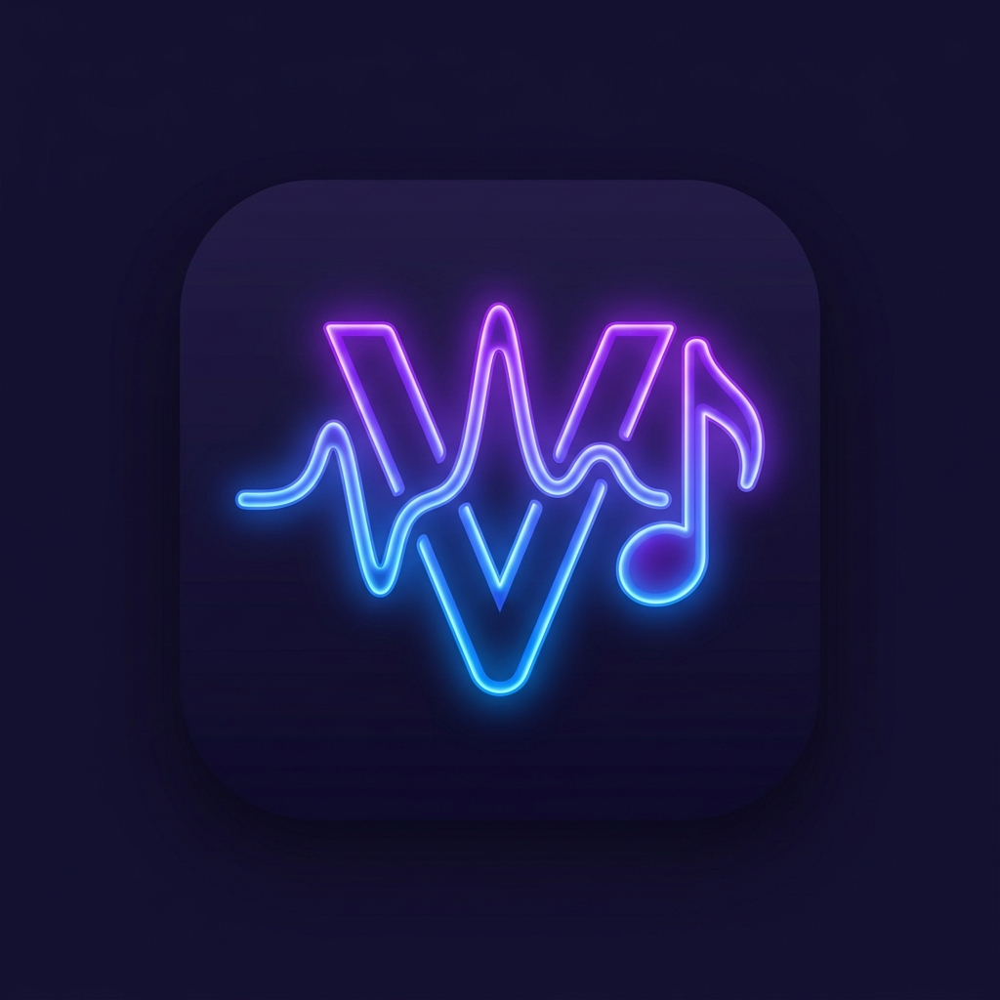

# Vmusix — Modern YouTube Music Player

<p align="center">
  
</p>

<p align="center">
  <b>Aplikasi Pemutar Musik Modern, Minimalis, dan Berkinerja Tinggi Berbasis YouTube Music</b><br>
  Dilengkapi Lirik Otomatis Tersinkronisasi, Pemutaran Audio Offline (Room Database), Pencarian Musik Shazam-Style, dan Manajemen Unduhan Cerdas.
</p>

<p align="center">
  
  
  
  
  
  
  
</p>

---

## 📑 Daftar Isi
1. [Tentang Vmusix](#-tentang-vmusix)
2. [Fitur Unggulan](#-fitur-unggulan)
3. [Arsitektur & Teknologi](#-arsitektur--teknologi)
4. [Struktur Proyek](#-struktur-proyek)
5. [Skema Basis Data (Room Offline Cache)](#-skema-basis-data-room-offline-cache)
6. [Langkah-Langkah Implementasi & Pembuatan](#-langkah-langkah-implementasi--pembuatan)
7. [Panduan Menjalankan Secara Lokal](#-panduan-menjalankan-secara-lokal)
8. [Panduan GitHub Actions Workflow (CI/CD)](#-panduan-github-actions-workflow-cicd)
9. [Rebranding Dinamis](#-rebranding-dinamis)
10. [Lisensi & Kredit](#-lisensi--kredit)

---

## 🎧 Tentang Vmusix

**Vmusix** adalah aplikasi pemutar musik streaming dan offline masa kini untuk Android yang dibangun sepenuhnya menggunakan teknologi modern Google (**Jetpack Compose**, **Material Design 3**, dan **AndroidX Media3**).

Aplikasi mengadopsi tema estetika **Midnight Purple (`#6D28D9`)** dan **Electric Blue (`#3B82F6`)** dengan latar belakang gelap pekat serta kartu *glassmorphism* lembut. Dirancang dengan prinsip **Clean Architecture & MVVM**, Vmusix mampu memutar musik secara efisien di latar belakang (*background service*), menyinkronkan lirik real-time dengan multi-provider fallback, serta mengelola file audio offline menggunakan Room Database.

---

## ✨ Fitur Unggulan

### 1. 🎵 Pemutar Musik Canggih (ExoPlayer Media3)
* **Docked Mini Player:** Melayang di atas navigasi bawah dengan thumbnail album, judul lagu, progress bar indikator, dan tombol Play/Pause.
* **Full Player Interaktif:**
  * Latar belakang blur adaptif yang diekstrak secara otomatis dari cover album yang sedang diputar.
  * Seekbar linier presisi dengan informasi durasi berlalu dan sisa waktu.
  * Dukungan gestur geser (*swipe horizontal*) untuk beralih lagu sebelumnya atau berikutnya.
  * Mode putar: **Shuffle (Acak)** dan **Repeat (Off, All, One)**.
  * **Sleep Timer:** Pengatur waktu tidur otomatis (15, 30, 45, 60 menit).
  * **Playback Speed:** Pengatur kecepatan pemutaran suara (0.5x, 0.75x, 1.0x, 1.25x, 1.5x, 2.0x).
  * **Antrean Lagu (Queue Sheet):** Tampilan daftar antrean lagu saat ini.
* **Background Playback & Lockscreen Control:** Menggunakan `MediaSessionService` (`VmusixPlaybackService`) sehingga audio terus berjalan meski layar mati atau berpindah aplikasi.

### 2. 🎤 Lirik Otomatis Tersinkronisasi (Multi-Provider Fallback Cascade)
Sistem pencarian lirik otomatis bertingkat yang tidak pernah gagal memuat lirik:
1. **YouTube Music Timed Lyrics**
2. **LRCLIB** (Public Synced Lyrics API)
3. **Better Lyrics**
4. **KuGou**
5. **Paxsenix**
* *Karaoke-Style Auto Scroll:* Penyorotan baris lirik aktif secara halus (smooth 60fps).
* *Interactive Seek:* Ketuk baris lirik mana pun untuk langsung melompat ke detik audio tersebut.
* *Offline Lrc Caching:* Lirik tersimpan di Room database sehingga lirik tetap tampil saat offline.

### 3. 🔍 Pencarian Real-Time & Pengenal Musik (Shazam-Style)
* **Debounced Search:** Pencarian instan (300ms debounce) dengan tab kategori: Semua, Lagu, Artis, Album, Playlist, Podcast, dan Video Musik.
* **Acoustic Audio Recognition:** Rekam audio sekitar melalui mikrofon dengan visualisasi gelombang spektrum (*real-time waveform visualizer*) untuk mencocokkan lagu di sekitar secara instan.

### 4. 💾 Penyimpanan & Caching Offline (Room Database Layer)
* **Manajemen Unduhan:** Unduh lagu individual, album, dan playlist dengan indikator progres real-time, status (Queued, Downloading, Paused, Completed), dan kontrol Jeda/Lanjut/Batal.
* **Auto-Cache:** Audio dan metadata lagu otomatis di-cache ke memori lokal saat diputar untuk menghemat kuota streaming.
* **Statistik Cache:** Monitor ukuran penggunaan memori (MB Audio, Jumlah Lirik Offline, MB Gambar) dengan tombol bersihkan cache 1-ketukan.
* **Impor File Audio Lokal:** Pindai musik dari Android MediaStore dan pilih file audio langsung dari penyimpanan menggunakan Storage Access Framework (SAF zero-permission).

### 5. 🎨 UI & Tema Modern (Material You)
* 5 Preset Tema bawaan:
  1. *Midnight Purple & Electric Blue* (Default)
  2. *Cyber Neon & Violet*
  3. *Deep OLED Black*
  4. *Sunset Velvet*
  5. *Oceanic Depths*
* **Custom Loader Minimalis:** Animasi cincin ganda berputar 60fps tanpa tulisan, tanpa persentase, dan tanpa logo yang warnanya mengikuti tema aktif.

### 6. 📻 Last.fm Scrobbler
* Pencatatan scrobble lagu otomatis ke akun Last.fm dan pemantauan riwayat mendengarkan.

---

## 🏗️ Arsitektur & Teknologi

Aplikasi mengimplementasikan **Clean Architecture** berlapis untuk memastikan skalabilitas, keandalan, dan kemudahan pengujian:

```
┌────────────────────────────────────────────────────────┐
│           Presentation Layer (Jetpack Compose)         │
│  - HomeScreen  - SearchScreen  - LibraryScreen         │
│  - MiniPlayer  - FullPlayerSheet  - SyncedLyricsPanel  │
└──────────────────────────┬─────────────────────────────┘
                           │
┌──────────────────────────▼─────────────────────────────┐
│                      ViewModel                         │
│  - MainViewModel (StateFlow, Coroutine Scope)          │
└──────────────────────────┬─────────────────────────────┘
                           │
┌──────────────────────────▼─────────────────────────────┐
│                     Domain Layer                       │
│  - Models: Track, Lyrics, Playlist, DownloadItem       │
│  - State: PlaybackState, LocalStorageState             │
└──────────────────────────┬─────────────────────────────┘
                           │
┌──────────────────────────▼─────────────────────────────┐
│                      Data Layer                        │
│  - MusicRepository (Unified Single Source of Truth)   │
│  - TrackCacheRepository (Room Offline Cache Engine)    │
│  - InnerTubeClient (YouTube Music API / Stream Parser) │
│  - LyricsService (5-Provider Fallback Cascade Engine)  │
│  - DownloadManager & CacheManager                      │
│  - VmusixDatabase (Room SQLite Engine)                 │
└──────────────────────────┬─────────────────────────────┘
                           │
┌──────────────────────────▼─────────────────────────────┐
│                    Core System Engine                  │
│  - AndroidX Media3 ExoPlayer & MediaSessionService     │
│  - AudioRecognitionManager (Microphone FFT Visualizer) │
│  - LocalMediaScanner (MediaStore & SAF Audio Importer) │
└────────────────────────────────────────────────────────┘
```

---

## 📂 Struktur Proyek

```
Vmusix/
├── .github/
│   └── workflows/
│       └── android-build.yml        # Workflow CI/CD otomatis untuk build APK
├── app/
│   ├── src/
│   │   ├── main/
│   │   │   ├── assets/
│   │   │   │   └── app_icon.png     # Master file icon untuk rebranding dinamis
│   │   │   ├── java/com/example/
│   │   │   │   ├── MainActivity.kt  # Entry point & Navigasi 3-Menu
│   │   │   │   ├── VmusixApplication.kt # Dependency injector & initializers
│   │   │   │   ├── core/
│   │   │   │   │   ├── audio/       # Shazam acoustic recognition manager
│   │   │   │   │   ├── components/  # VmusixLoader, GlassCard, Waveform visualizer
│   │   │   │   │   ├── player/      # ExoPlayer manager & PlaybackService
│   │   │   │   │   └── util/        # Dynamic AppBranding loader
│   │   │   │   ├── data/
│   │   │   │   │   ├── cache/       # CacheManager (audio & storage stats)
│   │   │   │   │   ├── download/    # DownloadManager (queue & progress)
│   │   │   │   │   ├── innertube/   # InnerTube client (stream resolver)
│   │   │   │   │   ├── lastfm/      # LastFmService scrobbler
│   │   │   │   │   ├── local/       # Room database, entities, and DAOs
│   │   │   │   │   │   ├── VmusixDatabase.kt
│   │   │   │   │   │   ├── LocalMediaScanner.kt
│   │   │   │   │   │   ├── dao/MusicDaos.kt
│   │   │   │   │   │   └── entities/DatabaseEntities.kt
│   │   │   │   │   ├── lyrics/      # 5-Tier prioritized lyrics fallback engine
│   │   │   │   │   └── repository/  # MusicRepository & TrackCacheRepository
│   │   │   │   ├── domain/model/    # Domain data models & enums
│   │   │   │   ├── feature/
│   │   │   │   │   ├── home/        # Home screen
│   │   │   │   │   ├── search/      # Search & Shazam screen
│   │   │   │   │   ├── library/     # Library / Lainnya screen
│   │   │   │   │   └── player/      # Mini & Full player composables
│   │   │   │   └── ui/
│   │   │   │       ├── MainViewModel.kt
│   │   │   │       └── theme/       # Midnight Purple, Electric Blue, Palettes
│   │   │   ├── res/                 # Resource Android (Drawables, Values, Mipmap)
│   │   │   └── AndroidManifest.xml  # Deklarasi izin audio, notifikasi, dan service
│   │   └── test/java/com/example/
│   │       ├── ExampleUnitTest.kt   # Unit test parsers, offline state, and models
│   │       └── ExampleRobolectricTest.kt # Robolectric Android integration test
│   └── build.gradle.kts             # Konfigurasi dependensi modul aplikasi
├── gradle/
│   └── libs.versions.toml           # Version Catalog Gradle
├── build.gradle.kts                 # Root Gradle build script
├── settings.gradle.kts              # Konfigurasi nama proyek Vmusix
└── metadata.json                    # Metadata identitas AI Studio / Project
```

---

## 🗄️ Skema Basis Data (Room Offline Cache)

Entitas utama `TrackEntity` di dalam `VmusixDatabase` didesain untuk menjamin pemutaran offline tanpa kehilangan metadata:

```kotlin
@Entity(
    tableName = "tracks",
    indices = [
        Index(value = ["offlineAvailable"]),
        Index(value = ["isLiked"]),
        Index(value = ["isDownloaded"]),
        Index(value = ["localFilePath"])
    ]
)
data class TrackEntity(
    @PrimaryKey val id: String,
    val title: String,
    val artist: String,
    val artistId: String,
    val album: String,
    val albumId: String,
    val durationSeconds: Long,
    val artworkUrl: String,
    val streamUrl: String,
    val isLiked: Boolean,
    val isDownloaded: Boolean,
    val isCached: Boolean,
    val localFilePath: String?,        // Path absolut audio di disk lokal
    val storageState: String,         // ONLINE_ONLY, CACHED_STREAM, DOWNLOADED, LOCAL_DEVICE
    val fileSizeBytes: Long,          // Ukuran byte di disk untuk manajemen kuota
    val mimeType: String,             // Tipe audio (misal audio/mp4, audio/mpeg)
    val offlineAvailable: Boolean,     // True jika file lokal ada dan siap diputar offline
    val playCount: Long,
    val lastPlayedAt: Long,
    val cachedAt: Long,
    val dateAdded: Long
)
```

Tabel pelengkap lainnya:
* `playlists` & `playlist_tracks`: Relasi N:M untuk playlist kustom dan cerdas.
* `downloads`: Status antrean, unduhan aktif, dan persentase byte.
* `lyrics_cache`: Caching lirik sinkron berformat LRC.
* `history`: Riwayat 50 trek yang didengarkan pengguna.

---

## 🚀 Langkah-Langkah Implementasi & Pembuatan

Berikut adalah urutan tahapan pengembangan aplikasi hingga sukses:

### Tahap 1: Inisialisasi Identitas & Branding Proyek
1. Tetapkan nama aplikasi menjadi **Vmusix** di `settings.gradle.kts`, `res/values/strings.xml`, dan `metadata.json`.
2. Generate adaptive icon berbasis Material You dan letakkan master icon di `app/src/main/assets/app_icon.png`.
3. Buat helper `AppBranding.kt` agar seluruh logo di antarmuka membaca berkas asset tersebut secara dinamis.

### Tahap 2: Konfigurasi Dependensi & Permission
1. Tambahkan dependensi ke `gradle/libs.versions.toml`:
   * `androidx.media3:media3-exoplayer:1.5.1`
   * `androidx.media3:media3-session:1.5.1`
   * `androidx.room:room-runtime:2.7.0` & `ksp(libs.androidx.room.compiler)`
   * `io.coil-kt:coil-compose:2.7.0`
2. Konfigurasikan izin di `AndroidManifest.xml`:
   * `RECORD_AUDIO` (untuk Shazam recognition)
   * `FOREGROUND_SERVICE` & `FOREGROUND_SERVICE_MEDIA_PLAYBACK`
   * `POST_NOTIFICATIONS`
   * `READ_MEDIA_AUDIO` / `READ_EXTERNAL_STORAGE`

### Tahap 3: Pembuatan Data Layer & Domain Models
1. Rancang model `Track`, `LyricsData`, `Playlist`, dan enum `LocalStorageState`.
2. Buat tabel Room Entity (`TrackEntity`, `PlaylistEntity`, `DownloadEntity`, `LyricsCacheEntity`).
3. Buat DAO (`TrackDao`, `PlaylistDao`, `DownloadDao`, `LyricsDao`, `HistoryDao`) dengan fungsi reaktif `Flow<List<T>>`.
4. Implementasikan `TrackCacheRepository` untuk mengabstraksikan penyimpanan file offline, pengecekan integritas file disk, dan pelacakan byte penyimpanan.

### Tahap 4: Core Services & Audio Engine
1. Buat `MusicPlayerManager` yang mengontrol `ExoPlayer` (Audio Focus, Repeat, Shuffle, Sleep Timer, Speed, Queue).
2. Daftarkan `VmusixPlaybackService` turunan `MediaSessionService` agar pemutaran berjalan di background.
3. Buat `LyricsService` dengan mekanisme fallback cascade 5 provider (YTM -> LRCLIB -> Better Lyrics -> KuGou -> Paxsenix).
4. Buat `AudioRecognitionManager` yang merekam buffer mikrofon dan menghitung amplitudo visualizer spektrum.

### Tahap 5: Antarmuka UI (Jetpack Compose & M3)
1. Kembangkan `VmusixTheme` dengan warna Midnight Purple dan Electric Blue.
2. Buat komponen `VmusixLoader` 60 FPS tanpa teks/logo/persentase.
3. Susun 3 layar navigasi utama:
   * **Home:** Quick Picks, Rekomendasi, Trending, Artis Favorit.
   * **Cari:** Real-time search 300ms + Modal Shazam.
   * **Lainnya:** Modern cards untuk Cache, Lagu Disukai, Unduhan, Playlist, Tema, dan Last.fm.
4. Buat **Mini Player** di bagian bawah dan **Full Player Sheet** dengan latar belakang blur sampul album serta lirik tersinkronisasi.

### Tahap 6: Pengujian Unit & Verifikasi
1. Tulis unit test untuk verifikasi parser LRC, indeks lirik aktif, katalog lagu, dan pemetaan TrackEntity offline di `ExampleUnitTest.kt`.
2. Jalankan `gradle :app:testDebugUnitTest` hingga status **BUILD SUCCESSFUL**.

---

## 💻 Panduan Menjalankan Secara Lokal

### Prasyarat
* **JDK 17** atau lebih baru
* **Android Studio Ladybug (2024.2.1)** atau versi terbaru
* Android SDK (API 34 atau API 36)

### Langkah-Langkah:
1. **Clone repositori:**
   ```bash
   git clone https://github.com/<username>/vmusix.git
   cd vmusix
   ```
2. **Buka proyek di Android Studio:**
   * Buka Android Studio -> *Open* -> pilih folder *vmusix*.
   * Biarkan Gradle melakukan sync project.
3. **Jalankan Unit Test:**
   ```bash
   ./gradlew testDebugUnitTest
   ```
4. **Build APK Debug:**
   ```bash
   ./gradlew assembleDebug
   ```
   APK akan tersedia di: `app/build/outputs/apk/debug/app-debug.apk`
5. **Install ke Perangkat / Emulator:**
   * Tekan tombol **Run (Shift + F10)** di Android Studio.

---

## 🤖 Panduan GitHub Actions Workflow (CI/CD)

Berkas workflow otomatis telah disediakan di `.github/workflows/android-build.yml`.

### Cara Kerja Workflow:
* **Trigger Otomatis:**
  * Berjalan pada setiap `push` ke branch `main` atau `master`.
  * Berjalan pada setiap pembuatan `Pull Request`.
  * Berjalan otomatis saat ada `tag` rilis baru (misal `v1.0.0`).
  * Dapat dipicu secara manual melalui tab **Actions -> Run workflow** (*workflow_dispatch*).
* **Tahapan Eksekusi:**
  1. *Checkout* kode sumber.
  2. *Setup JDK 17* (Temurin distribution) dengan caching Gradle otomatis.
  3. Validasi & eksekusi *Gradle Wrapper*.
  4. Menjalankan *Unit Tests* (`testDebugUnitTest`).
  5. Melakukan kompilasi *Debug APK* (`assembleDebug`).
  6. Mengunggah berkas APK ke GitHub Artifacts (tersedia untuk diunduh selama 14 hari).
  7. Jika dipicu oleh Tag Rilis (`v*`), workflow akan secara otomatis membuat rilis baru di tab *Releases* GitHub beserta lampiran APK.

---

## 🎨 Rebranding Dinamis

Salah satu keunggulan arsitektur Vmusix adalah kemudahan dalam penggantian identitas aplikasi (*rebranding*) tanpa menyentuh kode program:

```
app/src/main/assets/
└── app_icon.png   <-- Ganti file PNG ini dengan logo baru Anda!
```

1. Cukup timpa file `app/src/main/assets/app_icon.png` dengan logo baru Anda (disarankan format PNG persegi, minimal 512x512 px).
2. Seluruh tampilan aplikasi (logo di bilah atas, kartu informasi, dan layar splash) akan langsung menggunakan icon baru secara otomatis saat aplikasi dijalankan kembali!

---

## 📜 Lisensi & Kredit

* **Arsitektur & Pengembangan:** [VeruProject](https://github.com/VeruProject)
* **Desain UI/UX:** Terinspirasi dari estetika modern YouTube Music & Material 3
* **Provider Lirik:** YouTube Music, LRCLIB, Better Lyrics, KuGou, Paxsenix

Dibuat dengan ❤️ oleh **VeruProject**.
Semua hak cipta dilindungi undang-undang.
